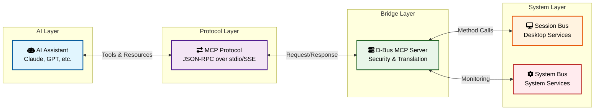

# D-Bus MCP Server

A Model Context Protocol (MCP) server that exposes D-Bus functionality to AI assistants, enabling deep integration with Linux systems - from vacuum cleaners to supercomputers.


## Vision

This project enables AI assistants to interact with Linux systems through the standardized D-Bus interface. While Linux runs on everything from vacuum cleaners to supercomputers, this MCP server focuses on two major system roles where D-Bus integration provides the most value:

### 1. Workstation Role (Interactive Desktop Systems)
For Linux desktop/laptop users, AI assistants can enhance productivity by:
- Managing clipboard content and history
- Sending desktop notifications
- Taking and analyzing screenshots
- Controlling media playback
- Monitoring system resources
- Integrating with desktop applications

### 2. Dedicated System Role (Servers, Appliances, Embedded)
For systems with specific purposes (web servers, routers, NAS, IoT devices), AI operates as a "maintenance robot" that can:
- Connect to servers via standardized D-Bus interfaces
- Discover available services and capabilities
- Monitor system health and performance
- Analyze logs and diagnose issues
- Perform authorized remediation actions
- Generate reports across server fleets

## Key Features

- **Secure by Design**: Multiple privilege levels, PolicyKit integration, audit logging
- **Desktop Environment Agnostic**: Uses freedesktop.org standards where possible
- **Discoverable**: Services self-document through D-Bus introspection
- **Type-Safe**: D-Bus provides strong typing for all operations
- **Rate Limited**: Prevents abuse of system resources

## Architecture

The MCP server acts as a bridge between AI assistants and the D-Bus system:



## 🔒 Security Model - Safety First

The D-Bus MCP server implements **configurable safety levels** to balance functionality with security:

### 🟢 **HIGH Safety (Default)** - Safest Choice
Essential operations with minimal risk: clipboard, notifications, media control, system monitoring

### 🟡 **MEDIUM Safety** - Productivity Mode  
Adds text editing, file management, and browser operations for AI-assisted workflows

### 🔴 **LOW Safety** *(Future)* - Advanced Users
Maximum functionality for expert users who understand the risks

### ⚫ **NEVER ALLOWED** - Hard Security Boundaries
Operations like shutdown, disk formatting, and package management are **always blocked**

```bash
# Choose your safety level
python -m dbus_mcp --safety-level high    # Default - safest
python -m dbus_mcp --safety-level medium  # Productivity features
```

**📖 [Complete Security Guide](docs/guides/SECURITY.md)**

## Quick Start

**📖 [Complete Quick Start Guide](docs/QUICKSTART.md)**

```bash
# Clone and install
git clone https://github.com/aaronsb/dbus-mcp.git
cd dbus-mcp
./quickstart.sh

# Test the installation
python test_installation.py

# Optional: Install as systemd service
./scripts/install-service.sh
```

The Quick Start Guide includes:
- System requirements and prerequisites
- Multiple installation methods
- Systemd service setup
- Configuration for Claude Desktop, Claude Code, and VS Code
- Troubleshooting tips

## Core Tools

The server starts with essential tools for D-Bus interaction:

### Basic Tools (Always Available)
1. **`help`** - Show available capabilities and tools
2. **`notify`** - Send desktop notifications
3. **`status`** - Get system status (battery, network, etc.)
4. **`discover`** - Explore available tool categories
5. **`list_services`** - List all D-Bus services
6. **`introspect`** - Explore service interfaces and methods
7. **`call_method`** - Call D-Bus methods (with security controls)

### Desktop Tools (When Display Available)
8. **`clipboard_read`/`clipboard_write`** - Clipboard access (KDE/GNOME)
9. **`capture_active_window`** - Screenshot the active window 📸
10. **`capture_screen`** - Screenshot entire screen 📸
11. **`list_screenshot_files`** - List captured screenshots

### 📸 Screenshot Capability (New!)
The server can now capture screenshots through D-Bus, storing them as temporary files with reference IDs. This enables AI assistants to:
- Capture windows or screens for visual context
- Document UI states
- Create visual bug reports
- Guide users with annotated screenshots

Screenshots are stored in `/tmp/dbus-mcp/` and tracked with metadata. See [Screenshot Authorization](docs/guides/SCREENSHOT-AUTHORIZATION.md) for KDE setup.

## Documentation

📚 **[Full Documentation](docs/README.md)**

### Key Documents:
- [Concept Overview](docs/design/CONCEPT.md) - Understand the vision
- [Architecture Overview](docs/architecture/ARCHITECTURE-OVERVIEW.md) - How it works
- [Security Model](docs/guides/SECURITY.md) - Security-first design
- [Examples](docs/guides/EXAMPLES.md) - See it in action

### For Developers:
- [CLAUDE.md](CLAUDE.md) - Development guidelines
- [Project Structure](docs/architecture/PROJECT-STRUCTURE.md) - Code organization
- [System Profiles](docs/architecture/SYSTEM-PROFILES.md) - Adapt to any Linux system

### For Operators:
- [Connection Architecture](docs/architecture/CONNECTION-ARCHITECTURE.md) - Deployment options
- [Privilege Model](docs/guides/PRIVILEGE-MODEL.md) - Security boundaries
- [System Roles](docs/design/SYSTEM-ROLES.md) - Workstation vs Server

## Status

🚧 **Alpha** - Basic functionality implemented, ready for testing

### What's Working:
- ✅ Core MCP server with stdio transport
- ✅ System profile auto-detection (KDE/Arch tested)
- ✅ Basic tools: notify, clipboard, status, help
- ✅ Security policies and rate limiting
- ✅ Progressive tool disclosure

### Coming Soon:
- 🔄 More desktop tools (screenshots, media control)
- 🔄 SystemD service integration  
- 🔄 Server fleet management tools
- 🔄 Additional system profiles (GNOME, Sway, etc.)

## License

MIT License - see [LICENSE](LICENSE) for details

## Contributing

We welcome contributions! Areas where help is especially appreciated:

- 🐧 **System Profiles**: Add support for your distro/desktop environment
- 🔧 **Tools**: Implement new D-Bus tools for common operations
- 📖 **Documentation**: Improve guides and examples
- 🧪 **Testing**: Test on different Linux systems

See [CLAUDE.md](CLAUDE.md) for development guidelines.