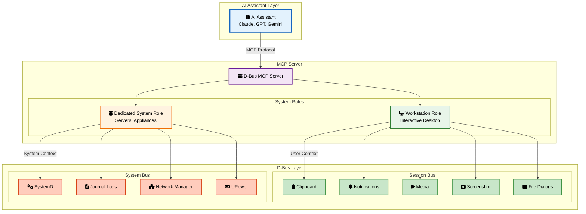
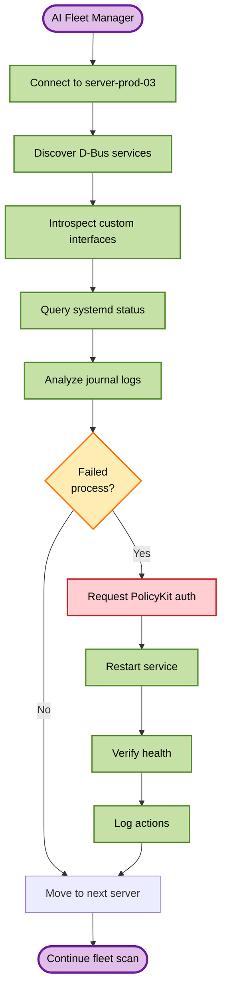
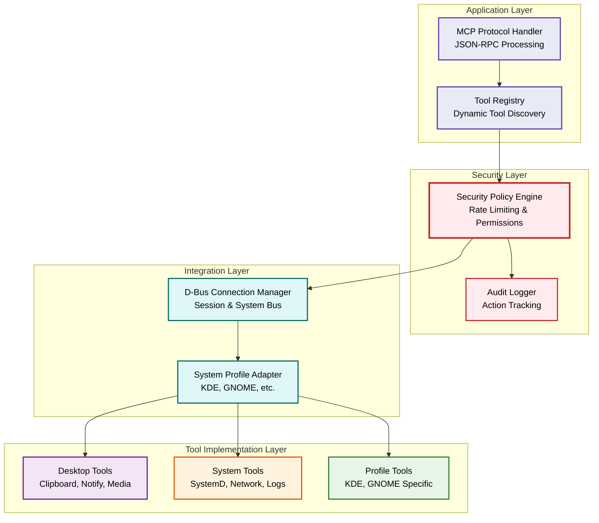

# D-Bus MCP Server - Architecture Overview

## Two Primary Linux System Roles



## Workstation Role: Desktop Collaboration Flow

```mermaid
sequenceDiagram
    participant U as User
    participant AI as AI Assistant
    participant MCP as D-Bus MCP
    participant D as Desktop Services
    
    U->>AI: "Help me debug this error"
    AI->>MCP: clipboard_read()
    MCP->>D: Get clipboard content
    D-->>MCP: Error message text
    MCP-->>AI: Context understood
    
    AI->>MCP: notify("Starting task...")
    MCP->>D: Show notification
    
    U->>AI: Shares screenshot
    AI->>MCP: analyze_screenshot()
    MCP->>D: Process image
    
    AI->>MCP: clipboard_write(solution)
    MCP->>D: Set clipboard
    
    AI->>MCP: media_pause()
    MCP->>D: Pause media players
    Note over U,D: Focus work time
    
    AI->>MCP: notify("Task complete!")
    MCP->>D: Show notification
    
    style U fill:#e8eaf6,stroke:#3f51b5,stroke-width:2px,color:#000
    style AI fill:#e0f2f1,stroke:#00796b,stroke-width:2px,color:#000
    style MCP fill:#fce4ec,stroke:#c2185b,stroke-width:2px,color:#000
    style D fill:#fff8e1,stroke:#f57c00,stroke-width:2px,color:#000
```

## Dedicated System Role: Remote Management Flow



## Security Zones

```mermaid
graph TB
    subgraph "Security Zones"
        subgraph "Zone 1: Green - Interactive Session"
            G1[fa:fa-clipboard Clipboard R/W]
            G2[fa:fa-bell Notifications]
            G3[fa:fa-camera Screenshots]
            G4[fa:fa-music Media Control]
        end
        
        subgraph "Zone 2: Yellow - System Read"
            Y1[fa:fa-battery-three-quarters Battery Status]
            Y2[fa:fa-wifi Network State]
            Y3[fa:fa-info-circle Service Info]
            Y4[fa:fa-chart-line System Metrics]
        end
        
        subgraph "Zone 3: Red - Privileged"
            R1[fa:fa-sync Service Restart]
            R2[fa:fa-network-wired Network Toggle]
            R3[fa:fa-cog Config Changes]
        end
        
        subgraph "Zone 4: Black - Forbidden"
            B1[fa:fa-power-off Shutdown/Reboot]
            B2[fa:fa-hdd Disk Format]
            B3[fa:fa-download Package Install]
            B4[fa:fa-key Password Changes]
        end
    end
    
    AI[fa:fa-robot AI Assistant] -->|"High Trust"| G1
    AI -->|"High Trust"| G2
    AI -->|"High Trust"| G3
    AI -->|"High Trust"| G4
    
    AI -->|"Medium Trust"| Y1
    AI -->|"Medium Trust"| Y2
    AI -->|"Medium Trust"| Y3
    AI -->|"Medium Trust"| Y4
    
    AI -->|"Auth Required"| R1
    AI -->|"Auth Required"| R2
    AI -->|"Auth Required"| R3
    
    AI -.->|"Always Denied"| B1
    AI -.->|"Always Denied"| B2
    AI -.->|"Always Denied"| B3
    AI -.->|"Always Denied"| B4
    
    style AI fill:#e1f5fe,stroke:#01579b,stroke-width:3px,color:#000
    
    classDef green fill:#c8e6c9,stroke:#2e7d32,stroke-width:2px,color:#000
    classDef yellow fill:#fff9c4,stroke:#f57f17,stroke-width:2px,color:#000
    classDef red fill:#ffcdd2,stroke:#c62828,stroke-width:2px,color:#000
    classDef black fill:#424242,stroke:#000000,stroke-width:3px,color:#fff
    
    class G1,G2,G3,G4 green
    class Y1,Y2,Y3,Y4 yellow
    class R1,R2,R3 red
    class B1,B2,B3,B4 black
```



### Zone Details

| Zone | Trust Level | Examples | Restrictions |
|------|------------|----------|--------------|
| 🟢 **Green** | High | Clipboard, notifications, screenshots | Rate limiting only |
| 🟡 **Yellow** | Medium | Battery status, network state, service info | Read-only access |
| 🔴 **Red** | Low | Service restart, network toggle | PolicyKit auth required |
| ⚫ **Black** | None | Shutdown, disk format, package install | Always denied |

## Implementation Layers



## Connection Modes

### Workstation Role
- Long-lived connection
- Stateful session
- User authentication
- Interactive operations
- Desktop environment integration

### Dedicated System Role
- Ephemeral connections
- Stateless operations
- Service authentication
- Batch processing
- Works on servers, routers, NAS, IoT devices, etc.

## Tool Categories

### Universal Tools
- `list_services` - Available on both buses
- `introspect` - Discover interfaces
- `call_method` - Generic invocation

### Desktop-Specific Tools
- `clipboard_*` - Session bus only
- `screenshot` - Requires display
- `media_control` - User media players

### Server-Specific Tools
- `systemd_*` - Service management
- `journal_*` - Log analysis
- `network_config` - Network state

This architecture enables the D-Bus MCP server to adapt to different Linux system roles - from interactive workstations where users need productivity tools, to dedicated systems (servers, appliances, embedded devices) that require remote monitoring and management. The same core technology serves vastly different purposes based on the system's role.