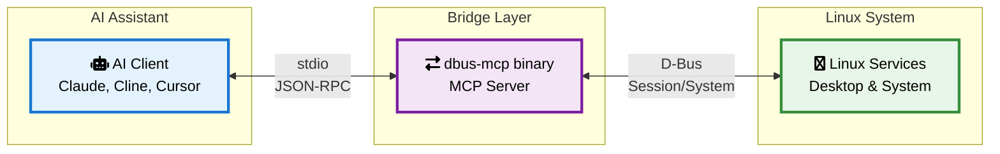

# D-Bus MCP Server - Connection Architecture

## Overview: Three Components



## Component Definitions

### 1. AI Client (MCP Client)
**What**: Claude Desktop, Claude Code, Cline, Cursor, etc.
**Purpose**: The AI assistant that wants to interact with your Linux system
**Connection**: Communicates via MCP protocol (JSON-RPC over stdio)
**Responsibilities**:
- Send tool requests (e.g., "read clipboard")
- Receive responses
- Handle user interactions

### 2. dbus-mcp Binary (MCP Server)
**What**: A single Python executable that bridges MCP ↔ D-Bus
**Purpose**: Translate between AI requests and D-Bus operations
**Connection**: 
- Input/Output: stdio with AI client (or HTTP in server mode)
- D-Bus: Session and/or system bus connections
**Responsibilities**:
- Implement MCP protocol
- Expose tools to AI
- Execute D-Bus operations
- Enforce security policies
- Handle system profile adaptation

### 3. Linux System (D-Bus Services)
**What**: The actual Linux desktop/system services
**Purpose**: The real functionality we're exposing
**Examples**:
- KDE Klipper (clipboard)
- Freedesktop Notifications
- SystemD units
- Media players

## Connection Flow

### Scenario: AI Reads Clipboard

```mermaid
sequenceDiagram
    participant User
    participant Claude as Claude Desktop
    participant MCP as dbus-mcp
    participant DBus as D-Bus Session
    participant KDE as Klipper Service
    
    User->>Claude: "What's in my clipboard?"
    Claude->>MCP: {"method": "tools/call",<br/>"params": {"name": "clipboard_read"}}
    MCP->>MCP: Check security policy
    MCP->>DBus: Connect to session bus
    DBus->>MCP: Connection established
    MCP->>KDE: getClipboardContents()
    KDE->>MCP: "Hello World"
    MCP->>Claude: {"result": {"content": [{<br/>"type": "text",<br/>"text": "Hello World"}]}}
    Claude->>User: "Your clipboard contains: Hello World"
    
    style User fill:#e8eaf6,stroke:#3f51b5,stroke-width:2px,color:#000
    style Claude fill:#e1f5fe,stroke:#0277bd,stroke-width:2px,color:#000
    style MCP fill:#fce4ec,stroke:#c2185b,stroke-width:2px,color:#000
    style DBus fill:#fff8e1,stroke:#f57c00,stroke-width:2px,color:#000
    style KDE fill:#e8f5e9,stroke:#388e3c,stroke-width:2px,color:#000
```
   
2. Claude Desktop invokes MCP tool:
   → {"method": "tools/call", "params": {"name": "dbus.clipboard.read"}}
   
3. dbus-mcp receives request via stdio:
   → Checks security policy (allowed)
   → Detects system profile (kde-arch)
   → Translates to D-Bus call
   
4. dbus-mcp calls D-Bus:
   → org.kde.klipper.getClipboardContents()
   
5. Klipper returns: "Hello World"
   
6. dbus-mcp sends MCP response:
   ← {"result": {"content": [{"type": "text", "text": "Hello World"}]}}
   
7. Claude shows user: "Your clipboard contains: Hello World"
```

## Deployment Models

### Model 1: Direct Execution (Development/Simple Use)
```bash
# AI client launches dbus-mcp directly
claude-desktop → spawns → python -m dbus_mcp.server
```

**Pros**: Simple, no installation needed
**Cons**: New process per session

### Model 2: SystemD User Service (Recommended)
```bash
# dbus-mcp runs as persistent user service
systemctl --user start dbus-mcp.service

# AI clients connect via socket
claude-desktop → connects to → /run/user/1000/dbus-mcp.socket
```

**Pros**: Single instance, resource efficient, socket activation
**Cons**: Requires installation

### Model 3: System Service (Server Mode)
```bash
# dbus-mcp runs as system service
systemctl start dbus-mcp-system.service

# Remote AI connects via HTTP
remote-ai → HTTP/SSE → http://server:8080/mcp
```

**Pros**: Remote access, fleet management
**Cons**: More complex security

## The dbus-mcp Binary

### Design Goals
1. **Single executable**: Can be run directly or installed
2. **Zero configuration**: Works out of the box with sensible defaults
3. **Profile detection**: Automatically adapts to system
4. **Multiple modes**: stdio (default), socket, HTTP

### Implementation Structure
```python
# src/dbus_mcp/__main__.py
def main():
    parser = argparse.ArgumentParser()
    parser.add_argument('--mode', choices=['stdio', 'socket', 'http'])
    parser.add_argument('--profile', help='Force specific system profile')
    
    args = parser.parse_args()
    
    # Detect or load profile
    profile = load_profile(args.profile)
    
    # Create MCP server with tools
    server = Server("dbus-mcp")
    register_tools(server, profile)
    
    # Run appropriate transport
    if args.mode == 'stdio':
        run_stdio_server(server)
    elif args.mode == 'socket':
        run_socket_server(server)
    elif args.mode == 'http':
        run_http_server(server)
```

### Execution Methods

#### 1. Direct Python Module
```bash
python -m dbus_mcp.server
```

#### 2. Installed Script
```bash
pip install dbus-mcp
dbus-mcp-server
```

#### 3. Standalone Bundle (Future)
```bash
# PyInstaller or similar
./dbus-mcp
```

## SystemD Integration

### User Service Unit
```ini
# ~/.config/systemd/user/dbus-mcp.service
[Unit]
Description=D-Bus MCP Server
After=graphical-session.target

[Service]
Type=notify
ExecStart=/usr/bin/python -m dbus_mcp.server --mode stdio
StandardInput=socket
StandardOutput=journal
StandardError=journal

# Security
NoNewPrivileges=true
PrivateTmp=true

[Install]
WantedBy=default.target
```

### Socket Activation
```ini
# ~/.config/systemd/user/dbus-mcp.socket
[Unit]
Description=D-Bus MCP Server Socket

[Socket]
ListenStream=%t/dbus-mcp.socket
Accept=false

[Install]
WantedBy=sockets.target
```

## Why This Architecture?

### Separation of Concerns
- **AI Clients**: Focus on AI/UX, not Linux specifics
- **dbus-mcp**: Handle all D-Bus complexity and Linux variants
- **System Services**: Remain unchanged, work normally

### Security Boundaries
- AI client can only use exposed MCP tools
- dbus-mcp enforces all security policies
- System services have normal D-Bus protections

### Flexibility
- Works with any MCP-compatible AI client
- Adapts to any Linux system via profiles
- Can run in multiple deployment modes

## Initial Implementation Plan

### Phase 1: Minimal Viable Server
```python
# Simplest possible implementation
async def main():
    # 1. Create MCP server
    server = Server("dbus-mcp")
    
    # 2. Add one simple tool
    @server.tool()
    async def notify(message: str) -> str:
        bus = SessionBus()
        notifier = bus.get('org.freedesktop.Notifications')
        notifier.Notify('dbus-mcp', 0, '', 'D-Bus MCP', message, [], {}, 5000)
        return "Notification sent"
    
    # 3. Run stdio transport
    async with stdio_transport(server):
        await server.wait_closed()
```

### Phase 2: Add Core Tools
- Clipboard read/write
- System status
- Basic discovery

### Phase 3: System Profiles
- Profile detection
- KDE-specific adapters
- GNOME adapters

### Phase 4: SystemD Integration
- Service files
- Socket activation
- Logging integration

This architecture provides a clean, secure, and flexible foundation for connecting AI assistants to Linux systems.