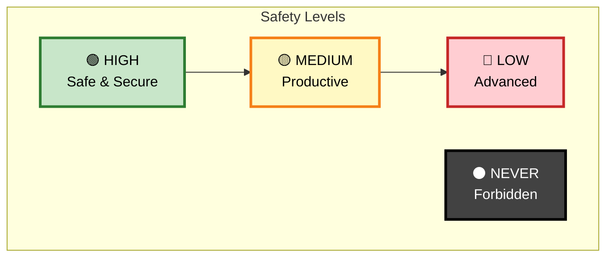

# D-Bus MCP Server - Security Architecture

## 🔒 Safety Levels - Security First Design

The D-Bus MCP server implements a **safety-first** approach with configurable security levels. Choose the level that balances functionality with your security requirements:

### 🟢 **HIGH Safety (Default)**
**"Safest Choice"** - Recommended for most users
- ✅ Clipboard read/write
- ✅ Desktop notifications
- ✅ Media player control  
- ✅ System status monitoring
- ✅ All read-only operations
- ❌ Text editor injection
- ❌ File manager control
- ❌ URL opening

```bash
python -m dbus_mcp --safety-level high  # Default
```

### 🟡 **MEDIUM Safety**
**"Productivity Mode"** - For users who need AI to help with desktop tasks
- ✅ Everything in HIGH level
- ✅ Text editor operations (Kate, etc.)
- ✅ File manager operations (open files/folders)
- ✅ Browser operations (open URLs)
- ✅ Window activation/focus
- ❌ System configuration changes
- ❌ Service management

```bash
python -m dbus_mcp --safety-level medium
```

### 🔴 **LOW Safety** *(Future)*
**"Advanced Users Only"** - Maximum functionality with higher risk
- ✅ Everything in MEDIUM level
- ✅ Network configuration (read-only)
- ✅ Service status queries
- ⚠️  **Not yet implemented**

### ⚫ **NEVER ALLOWED** *(All Levels)*
These operations are **hard-blocked** regardless of safety level:
- ❌ System shutdown/reboot
- ❌ Disk formatting
- ❌ Package installation/removal
- ❌ Password changes
- ❌ Root privilege escalation



## 🛡️ Why Safety Levels Matter

D-Bus provides deep system access. Our safety levels ensure:

1. **🟢 HIGH protects you** from accidental system interference
2. **🟡 MEDIUM enables productivity** while maintaining boundaries
3. **🔴 LOW offers flexibility** for advanced users who understand the risks
4. **⚫ NEVER blocks dangerous operations** that could harm your system

> **💡 Recommendation**: Start with HIGH safety and only move to MEDIUM if you specifically need AI assistance with text editing or file management.

## Security Contexts Overview

### 1. Session Bus (User Context)
- **Runs as**: Current user
- **Access to**: Desktop applications, user services
- **Risk level**: Medium
- **Examples**: Media players, notifications, clipboard

### 2. System Bus (Root/System Context)
- **Runs as**: System services, potentially root
- **Access to**: Hardware, network, system services
- **Risk level**: High
- **Examples**: NetworkManager, systemd, UPower

## Architecture: Privilege Separation

```
┌─────────────────────────────────────────────┐
│             MCP Client (AI)                 │
└─────────────────────────────────────────────┘
                      │
                      ▼
┌─────────────────────────────────────────────┐
│         MCP Server (User Context)           │
│  - Handles all MCP protocol communication   │
│  - Enforces security policies               │
│  - Direct access to session bus only        │
└─────────────────────────────────────────────┘
                      │
         ┌────────────┴────────────┐
         ▼                         ▼
┌──────────────────┐     ┌───────────────────────┐
│   Session Bus    │     │  System Bus Proxy     │
│  (Direct Access) │     │  (Restricted Access)  │
└──────────────────┘     └───────────────────────┘
                                   │
                                   ▼
                         ┌───────────────────────┐
                         │ PolicyKit/sudo Helper │
                         │  (Separate Process)   │
                         └───────────────────────┘
```

## Security Model

### Principle: Least Privilege by Default

1. **MCP Server runs as regular user**
   - No root access
   - No setuid binaries
   - No direct system bus write access

2. **System Bus Access via Proxy**
   - Read-only by default
   - Explicit whitelist for safe system queries
   - No direct method calls to system services

3. **Privileged Operations via Helper**
   - Separate process with minimal privileges
   - PolicyKit integration for authorization
   - Audit logging for all privileged operations

## Context-Specific Permissions

### Session Bus (User Context) - ALLOWED

```python
SAFE_SESSION_OPERATIONS = {
    # Desktop notifications
    "org.freedesktop.Notifications": ["Notify", "GetCapabilities"],
    
    # Media control (read/control only)
    "org.mpris.MediaPlayer2.*": ["Play", "Pause", "Next", "Previous", "Get*"],
    
    # Screenshots
    "org.gnome.Shell.Screenshot": ["Screenshot", "ScreenshotArea", "ScreenshotWindow"],
    
    # Clipboard (with rate limiting)
    "org.freedesktop.portal.Desktop": ["ReadClipboard", "WriteClipboard"],
    
    # File chooser (read paths only)
    "org.freedesktop.portal.FileChooser": ["OpenFile", "SaveFile"],
}
```

### System Bus - READ ONLY

```python
SAFE_SYSTEM_QUERIES = {
    # Battery information
    "org.freedesktop.UPower": {
        "methods": ["GetDisplayDevice", "GetCriticalAction"],
        "properties": ["Percentage", "State", "TimeToEmpty"]
    },
    
    # Network status (read only)
    "org.freedesktop.NetworkManager": {
        "methods": ["GetDevices", "GetActiveConnections"],
        "properties": ["State", "Connectivity", "WirelessEnabled"]
    },
    
    # System information
    "org.freedesktop.hostname1": {
        "properties": ["Hostname", "KernelName", "KernelRelease"]
    },
    
    # Time/timezone (read only)
    "org.freedesktop.timedate1": {
        "properties": ["Timezone", "LocalRTC", "NTP"]
    }
}
```

### System Bus - NEVER ALLOWED

```python
FORBIDDEN_OPERATIONS = {
    # Power management
    "org.freedesktop.login1": ["PowerOff", "Reboot", "Suspend", "Hibernate"],
    
    # Disk operations
    "org.freedesktop.UDisks2": ["Format", "Delete", "CreatePartition"],
    
    # Package management
    "org.freedesktop.PackageKit": ["InstallPackages", "RemovePackages"],
    
    # System configuration
    "org.freedesktop.systemd1": ["StartUnit", "StopUnit", "ReloadUnit"],
    
    # Network configuration
    "org.freedesktop.NetworkManager": ["Enable", "Disable", "AddConnection"],
}
```

## Implementation Patterns

### 1. Safe Session Bus Access

```python
class SessionBusAccess:
    def __init__(self):
        self.bus = SessionBus()
        self.rate_limiter = RateLimiter()
    
    def call_method(self, service, method, args):
        # Check whitelist
        if not self.is_whitelisted(service, method):
            raise SecurityError(f"Method {method} not allowed on {service}")
        
        # Apply rate limiting
        if not self.rate_limiter.check(service, method):
            raise RateLimitError(f"Rate limit exceeded for {method}")
        
        # Execute with timeout
        with timeout(5):  # 5 second timeout
            return self.bus.call(service, method, args)
```

### 2. System Bus Read-Only Proxy

```python
class SystemBusProxy:
    def __init__(self):
        self.bus = SystemBus()
    
    def query_property(self, service, interface, property):
        # Only allow whitelisted read operations
        if not self.is_safe_read(service, interface, property):
            raise SecurityError(f"Property {property} not accessible")
        
        # Get property with timeout
        try:
            return self.bus.get(service).Get(interface, property)
        except Exception as e:
            # Log but don't expose internal errors
            logger.error(f"System bus error: {e}")
            raise SecurityError("Unable to query system property")
```

### 3. Privileged Helper Pattern

```python
# separate process: dbus-mcp-helper
class PrivilegedHelper:
    """Runs with minimal required privileges"""
    
    def __init__(self):
        # Drop all capabilities except what's needed
        self.drop_privileges()
        
        # Connect to PolicyKit
        self.polkit = PolicyKit()
    
    async def execute_privileged(self, action, user, params):
        # Check PolicyKit authorization
        auth = await self.polkit.check_authorization(
            action=f"com.dbus-mcp.{action}",
            user=user,
            interactive=True  # Can prompt user
        )
        
        if not auth.is_authorized:
            raise AuthorizationError("User denied authorization")
        
        # Execute with audit logging
        with audit_log(action, user, params):
            return self.execute_action(action, params)
```

## Security Policies

### 1. Default Policy (Restrictive)

```yaml
# /etc/dbus-mcp/policy.yaml
default_policy:
  session_bus:
    allow_introspection: true
    allow_property_read: true
    allow_method_call: whitelist_only
    rate_limits:
      notifications: 10/minute
      clipboard: 30/minute
      screenshots: 5/minute
  
  system_bus:
    allow_introspection: false
    allow_property_read: whitelist_only
    allow_method_call: false
    allow_signals: false
```

### 2. Developer Policy (Permissive)

```yaml
developer_policy:
  extends: default_policy
  session_bus:
    additional_whitelist:
      - "org.gnome.Terminal.*"
      - "org.freedesktop.DBus.Debugging.*"
    rate_limits:
      notifications: 100/minute
  
  system_bus:
    allow_introspection: true
    additional_reads:
      - "org.freedesktop.systemd1.Unit.ActiveState"
```

### 3. Kiosk Policy (Minimal)

```yaml
kiosk_policy:
  session_bus:
    allow_only:
      - "org.freedesktop.Notifications.Notify"
      - "org.mpris.MediaPlayer2.Player.PlayPause"
  
  system_bus:
    allow_all: false
```

## Runtime Security Measures

### 1. Sandboxing

```bash
# Run with systemd sandboxing
[Service]
Type=simple
ExecStart=/usr/bin/dbus-mcp-server
User=dbus-mcp
Group=dbus-mcp

# Security restrictions
NoNewPrivileges=true
PrivateTmp=true
ProtectSystem=strict
ProtectHome=true
ReadOnlyPaths=/
ReadWritePaths=/tmp/dbus-mcp
ProtectKernelTunables=true
ProtectKernelModules=true
ProtectControlGroups=true
RestrictNamespaces=true
LockPersonality=true
MemoryDenyWriteExecute=true
RestrictRealtime=true
SystemCallFilter=@system-service
SystemCallErrorNumber=EPERM
```

### 2. AppArmor Profile

```
# /etc/apparmor.d/usr.bin.dbus-mcp-server
profile dbus-mcp-server /usr/bin/dbus-mcp-server {
  #include <abstractions/base>
  #include <abstractions/dbus-session-strict>
  
  # D-Bus access
  dbus send bus=session,
  dbus receive bus=session,
  dbus send bus=system path=/org/freedesktop/UPower/**,
  
  # No network access
  deny network,
  
  # Limited file access
  /tmp/dbus-mcp/** rw,
  /etc/dbus-mcp/policy.yaml r,
  
  # No execution of other programs
  deny /usr/bin/x*,
  deny /bin/x*,
}
```

### 3. Audit Logging

```python
class AuditLogger:
    def __init__(self):
        self.log_file = "/var/log/dbus-mcp/audit.log"
        
    def log_operation(self, user, operation, service, method, args, result):
        entry = {
            "timestamp": datetime.utcnow().isoformat(),
            "user": user,
            "operation": operation,
            "service": service,
            "method": method,
            "args": self.sanitize_args(args),
            "result": result,
            "success": result != "DENIED"
        }
        
        # Write to append-only log
        with open(self.log_file, 'a') as f:
            f.write(json.dumps(entry) + '\n')
```

## Best Practices

1. **Never run MCP server as root**
2. **Use PolicyKit for privileged operations**
3. **Implement rate limiting on all operations**
4. **Log all security-relevant events**
5. **Fail closed - deny by default**
6. **Validate all inputs before D-Bus calls**
7. **Use timeouts on all D-Bus operations**
8. **Regular security audits of whitelist**

## Testing Security

```bash
# Test unauthorized access
$ dbus-mcp-test security --attempt-forbidden-calls

# Test rate limiting
$ dbus-mcp-test security --flood-notifications

# Test privilege escalation
$ dbus-mcp-test security --attempt-privilege-escalation

# Audit policy compliance
$ dbus-mcp-audit --policy /etc/dbus-mcp/policy.yaml
```