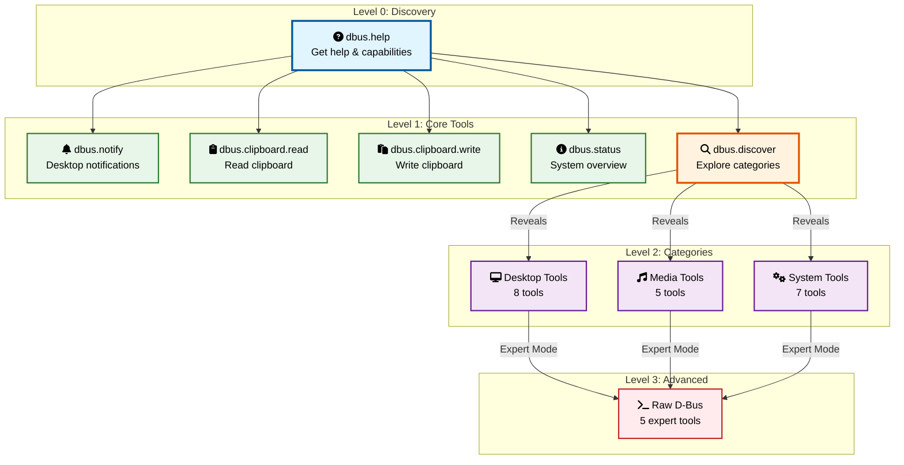

# D-Bus MCP Server - Tool Hierarchy Design

## Proposed Tool Structure



### Tool Details

#### Level 0: Discovery Tool (Always Available)
```
dbus.help - Get help about available D-Bus capabilities
```

#### Level 1: Core Tools (5 tools)
These are always presented to the AI:

```
dbus.notify          - Send desktop notification
dbus.clipboard.read  - Read clipboard contents  
dbus.clipboard.write - Write to clipboard
dbus.status          - Get system overview (battery, network, load)
dbus.discover        - Explore available capabilities by category
```

### Level 2: Category Tools (Revealed by Discovery)

When AI uses `dbus.discover`, it reveals category-specific tools:

#### Desktop Category (8 tools)
```
dbus.desktop.screenshot      - Take screenshot
dbus.desktop.pick_color      - Color picker tool
dbus.desktop.show_file       - Show file in file manager
dbus.desktop.open_uri        - Open URL in default app
dbus.desktop.inhibit_sleep   - Prevent system sleep
dbus.desktop.get_idle_time   - Get user idle time
dbus.desktop.lock_screen     - Lock the screen
dbus.desktop.get_theme       - Get current theme info
```

#### Media Category (5 tools)
```
dbus.media.list_players      - List active media players
dbus.media.play_pause        - Toggle playback
dbus.media.next_previous     - Skip tracks
dbus.media.get_metadata      - Get current track info
dbus.media.set_volume        - Adjust volume
```

#### System Category (7 tools)
```
dbus.system.battery_detail   - Detailed battery information
dbus.system.network_detail   - Detailed network status
dbus.system.service_list     - List system services
dbus.system.service_status   - Get service status
dbus.system.journal_recent   - Recent system logs
dbus.system.mount_points     - List mounted filesystems
dbus.system.hardware_info    - Basic hardware information
```

### Level 3: Advanced Tools (Revealed on Request)

These are only shown when specifically needed:

```
dbus.raw.list_services       - List all D-Bus services
dbus.raw.introspect         - Introspect any service
dbus.raw.call_method        - Call arbitrary D-Bus method
dbus.raw.get_property       - Get any D-Bus property
dbus.raw.monitor_signals    - Monitor D-Bus signals
```

## Progressive Discovery Example

### Initial State
AI sees only 5 core tools + help:
```
Available tools:
- dbus.help
- dbus.notify
- dbus.clipboard.read
- dbus.clipboard.write
- dbus.status
- dbus.discover
```

### User: "I need to control my music"
AI uses: `dbus.discover(category="media")`

Response reveals:
```
Media capabilities discovered:
- dbus.media.list_players - Found: spotify, chromium
- dbus.media.play_pause
- dbus.media.next_previous
- dbus.media.get_metadata
- dbus.media.set_volume
```

### Now AI has access to media tools
AI can use: `dbus.media.play_pause(player="spotify")`

## Tool Naming Conventions

### Hierarchy Rules
1. **Prefix**: Always `dbus.`
2. **Category**: Logical grouping (`desktop`, `media`, `system`, `raw`)
3. **Action**: Verb_noun format (`get_status`, `list_players`)

### Examples:
```
dbus.{category}.{action}

dbus.clipboard.read
dbus.desktop.take_screenshot  
dbus.system.get_service_status
dbus.media.control_playback
```

## Smart Tool Descriptions

Each tool has three levels of description:

```python
{
    "name": "dbus.clipboard.read",
    "summary": "Read clipboard contents",
    "description": "Read the current contents of the system clipboard. Returns text content if available.",
    "usage_hints": [
        "User asks 'what did I copy?'",
        "Need to access previously copied data",
        "Checking clipboard before write operation"
    ],
    "examples": [
        {"user": "Use what I just copied", "action": "dbus.clipboard.read()"},
        {"user": "What's in my clipboard?", "action": "dbus.clipboard.read()"}
    ]
}
```

## Category Metadata

Each category includes context about when to use it:

```python
CATEGORIES = {
    "desktop": {
        "description": "Desktop environment interaction",
        "use_when": "User needs screenshots, notifications, or desktop control",
        "requires": "Active desktop session",
        "tool_count": 8
    },
    "media": {
        "description": "Media player control", 
        "use_when": "User wants to control music/video playback",
        "requires": "Active media players",
        "tool_count": 5
    },
    "system": {
        "description": "System monitoring and management",
        "use_when": "User needs system information or service status",
        "requires": "Read access to system bus",
        "tool_count": 7
    }
}
```

## Adaptive Tool Loading

Track tool usage and preload frequently used categories:

```python
class AdaptiveToolLoader:
    def __init__(self):
        self.usage_stats = defaultdict(int)
        self.session_tools = set()
        
    def on_tool_use(self, tool_name):
        category = tool_name.split('.')[1]
        self.usage_stats[category] += 1
        
        # Auto-load category after 2 uses
        if self.usage_stats[category] >= 2:
            self.preload_category(category)
    
    def get_suggested_tools(self):
        # Suggest based on usage patterns
        frequent = sorted(self.usage_stats.items(), 
                         key=lambda x: x[1], reverse=True)
        return frequent[:3]
```

## Tool Aliases

Common operations have multiple access patterns:

```python
TOOL_ALIASES = {
    # Natural language variants
    "notify": "dbus.notify",
    "alert": "dbus.notify",
    "reminder": "dbus.notify",
    
    # Shortened forms
    "clip.read": "dbus.clipboard.read",
    "clip.write": "dbus.clipboard.write",
    
    # Common requests
    "screenshot": "dbus.desktop.screenshot",
    "screen": "dbus.desktop.screenshot"
}
```

## Benefits of This Approach

1. **Reduces Cognitive Load**: AI starts with just 5-6 tools
2. **Natural Discovery**: Tools revealed as needed
3. **Clear Organization**: Hierarchical naming prevents confusion
4. **Contextual**: Only show relevant tools
5. **Scalable**: Can add new categories without overwhelming
6. **Predictable**: Consistent naming patterns

This hierarchy ensures the AI can effectively use D-Bus without being overwhelmed by the hundreds of possible operations.